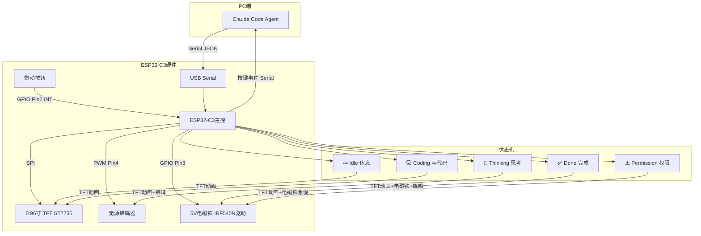

```mermaid
flowchart TD
  subgraph PC端
    CC[Claude Code Agent]
  end

  subgraph ESP32-C3硬件
    MCU[ESP32-C3主控]
    USB[USB Serial]
    TFT[0.96寸 TFT ST7735]
    BZ[无源蜂鸣器]
    SOL[5V电磁铁 IRF540N驱动]
    BTN[微动按钮]

    MCU -->|SPI| TFT
    MCU -->|PWM Pin4| BZ
    MCU -->|GPIO Pin3| SOL
    BTN -->|GPIO Pin2 INT| MCU
    USB --> MCU
  end

  subgraph 状态机
    IDLE[💤 Idle 休息]
    THINK[🤔 Thinking 思考]
    CODE[💻 Coding 写代码]
    DONE[✅ Done 完成]
    PERM[⚠️ Permission 权限]
  end

  CC -->|Serial JSON| USB
  MCU -->|按键事件 Serial| CC
  MCU --> IDLE
  MCU --> THINK
  MCU --> CODE
  MCU --> DONE
  MCU --> PERM

  IDLE -->|TFT动画| TFT
  THINK -->|TFT动画+蜂鸣| BZ
  CODE -->|TFT动画| TFT
  DONE -->|TFT动画+电磁铁+蜂鸣| SOL
  PERM -->|TFT动画+电磁铁急促| SOL
```
